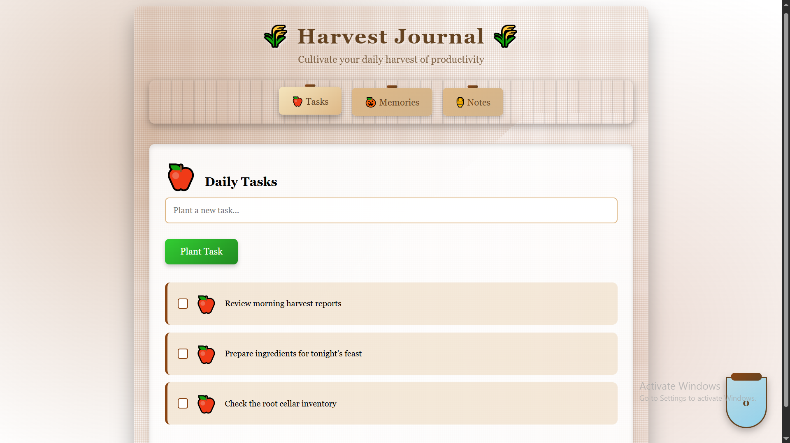
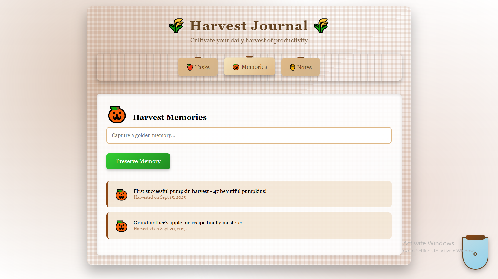
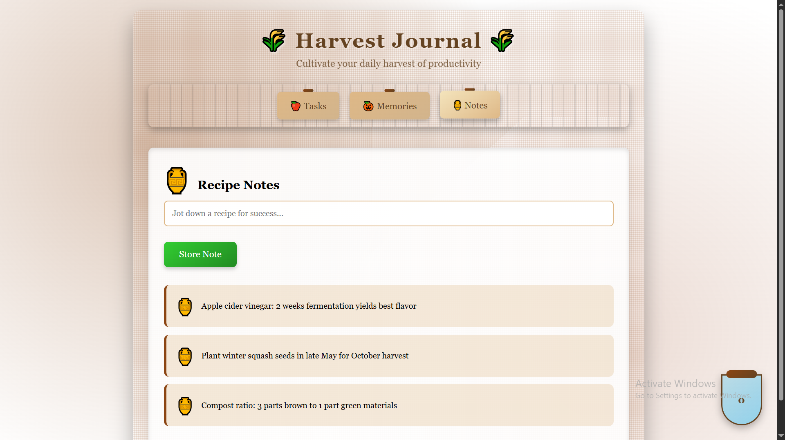

# 🌾 Harvest Journal

A beautiful, autumn-themed productivity web app to help you cultivate daily tasks, preserve memories, and store notes. Inspired by the spirit of harvest, this journal brings a cozy, seasonal touch to your workflow.

## Features
- **Tasks Tab:** Plant new tasks, mark them as completed, and watch your productivity grow.
- **Memories Tab:** Capture and preserve your favorite moments and achievements.
- **Notes Tab:** Jot down recipes, tips, or wisdom for future harvests.
- **Animated Jar:** Visual feedback for completed tasks with a delightful jar animation.
- **Responsive Design:** Works well on desktop and mobile browsers.

## Getting Started
1. Clone or download this repository.
2. Open `Autumn.html` in your browser.
3. Start planting tasks, preserving memories, and storing notes!

## File Structure
- `Autumn.html` — Main HTML file
- `style.css` — Styling for the journal
- `java.js` — JavaScript logic for tabs, tasks, memories, notes, and animations
- `screenshot/` — Folder containing screenshots

## Screenshots
Below are screenshots of the app in action:

| Tasks Tab | Memories Tab | Notes Tab |
|-----------|-------------|-----------|
|  |  |  |

## License
MIT

---
Enjoy your harvest season and stay productive! 🍎🎃🏺
